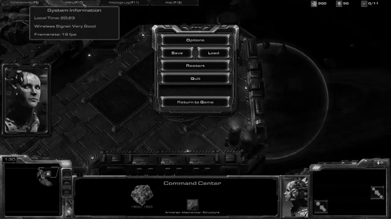
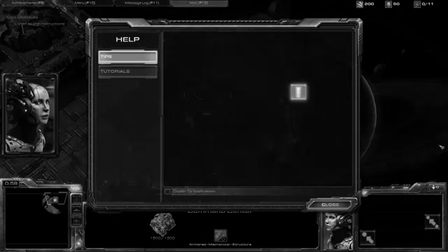

This repository shows how to detect Game's Menus during play.

It uses the differences between consecutive frames to detect if a large difference occurred. Afterwards, it uses OCR to look for common Menu buttons such as 'Options' or 'Exit'.

For Star Craft, the following Menu Frames have been detected in the video attached:

To make the system more reliable, possible next steps would be:

- try it on other games
- when multiple menu frames have been detected, compare them with each other to see if they cluster together
- once the menus have been successfully validated, use the menus' template only